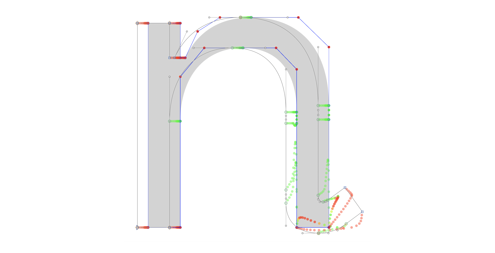
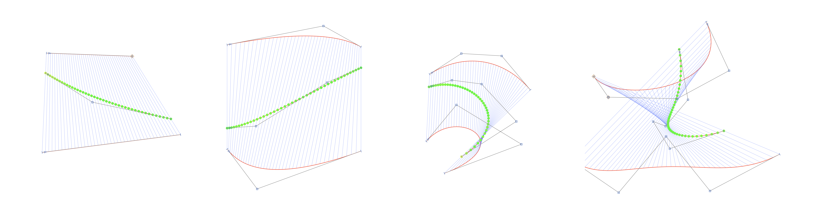
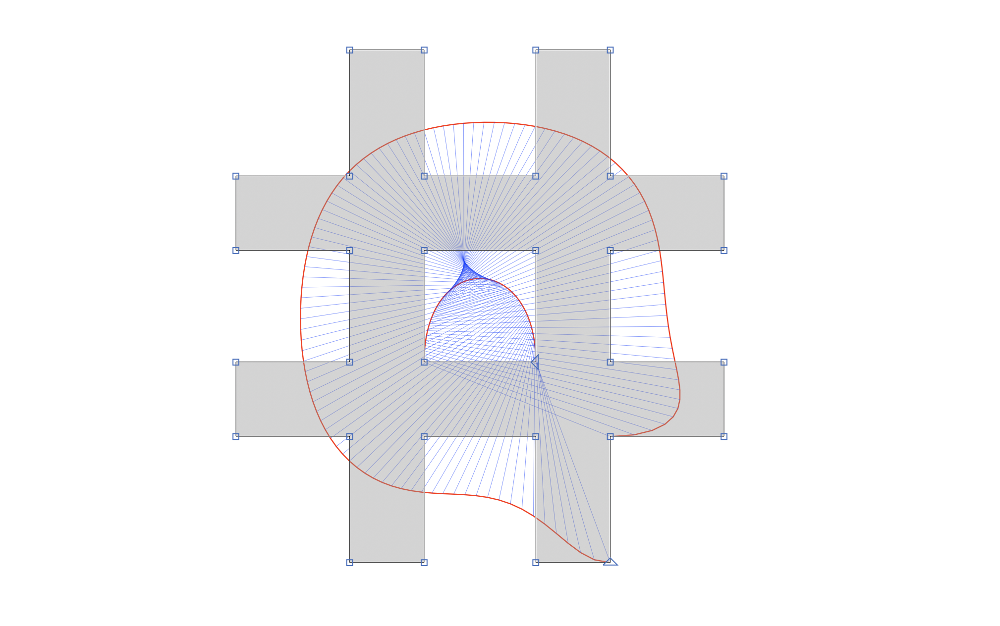

# Plugins

## HOI Viewer
A kink-proofer reporter plugin that is useful for previewing designspaces. It is capable of previewing at a specific location in the designspace or along an entire axis (HOI or regular).

## VizBez
A an experimental reporter plugin that converts polylines to nth-order bezier curves depending on the number of points and draws lines between them in increments of t. Useful for matching speed between orders of curvature (in a HOI setup) to create kink free interpolation.

Sometimes it can even make interesting visuals when using the plugin on a normal glyph. This octothorp from Space Mono creates a visual of a 27th order curve mapped to a cubic curve:

